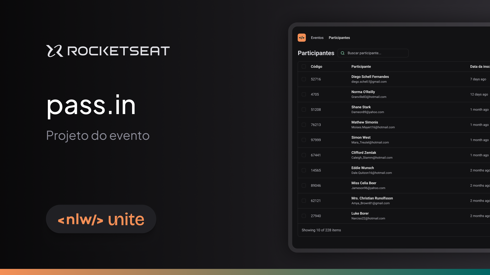

<h1 align="center"> pass.in </h1>

Aplicação desenvolvida na trilha ReactJS na NLW unite da Rocketseat.  

 

    
  

## 🚀 Tecnologias

Esse projeto foi desenvolvido com as seguintes tecnologias:

- TypeScript
- ReactJS
- Tailwindcss
- Faker-js

## 💻 Projeto

O pass.in é um sistema de check-in para eventos presenciais.

## 🔖 Layout

Você pode visualizar o layout do projeto através [DESSE LINK](https://www.figma.com/community/file/1356738933008624188).

## Licença

Esse projeto está sob a licença MIT.
